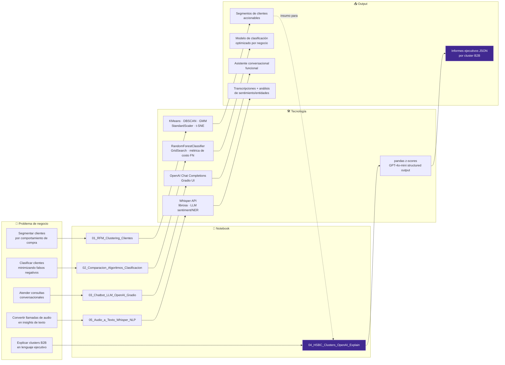
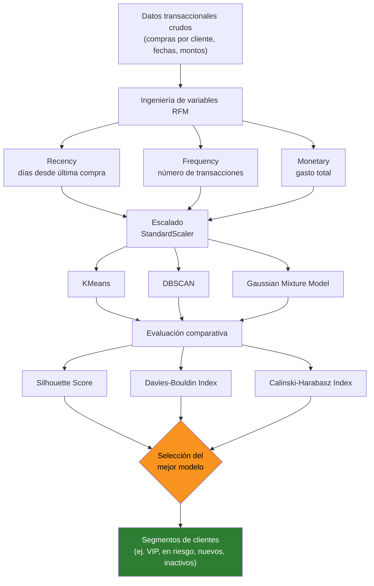
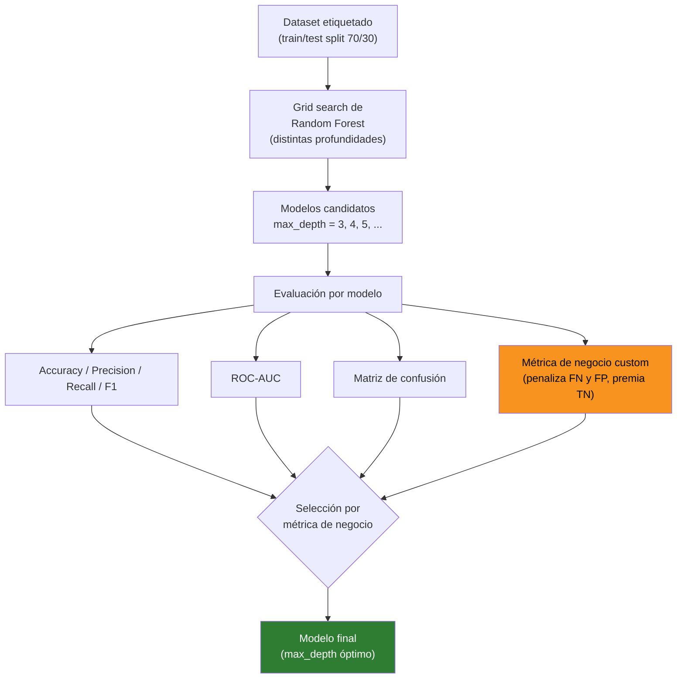
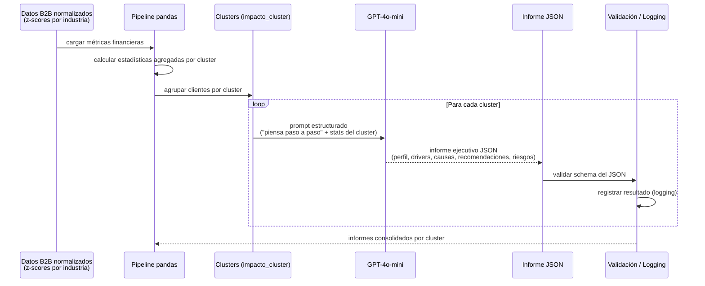
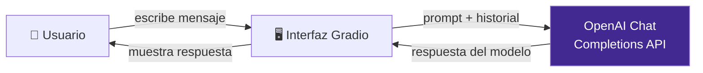

# 🧠 AI Empresarial — Clustering, Clasificación y LLMs Aplicados


> **El proyecto más avanzado de la carrera.** Cinco notebooks que recorren el ciclo completo de IA aplicada a negocio: segmentación no supervisada de clientes, clasificación supervisada optimizada por costo de negocio, un chatbot conversacional con LLM, un caso de consultoría real con **HSBC** donde GPT-4o-mini genera informes ejecutivos automáticos por cluster B2B, y un pipeline de audio-a-texto con Whisper + NLP. Curados de la materia **AI Empresarial** (S6), Licenciatura en Innovación y Tecnología (**LIT**), Tecnológico de Monterrey.

---

## 📑 Tabla de contenido

- [Mapa del repo](#-mapa-del-repo)
- [Contexto académico](#-contexto-académico)
- [Notebooks incluidos](#-notebooks-incluidos)
- [Deep dive: 01 — Segmentación RFM multi-algoritmo](#-01--segmentación-rfm-multi-algoritmo)
- [Deep dive: 02 — Comparación de clasificadores](#-02--comparación-de-clasificadores)
- [Deep dive: 04 — Caso HSBC: informes ejecutivos con GPT-4o-mini](#-04--caso-hsbc-informes-ejecutivos-con-gpt-4o-mini)
- [Deep dive: 03 — Chatbot LLM con Gradio](#-03--chatbot-llm-con-gradio)
- [Seguridad y manejo de credenciales](#️-seguridad-y-manejo-de-credenciales)
- [Datos](#-datos)
- [Cómo correrlo](#-cómo-correrlo)
- [Estructura del repo](#-estructura-del-repo)
- [Créditos](#-créditos)

---

## 🗺️ Mapa del repo

Cada notebook resuelve un problema de negocio distinto con una técnica de IA distinta. Así se conecta todo:



> 💡 El caso HSBC (`04`) consume conceptualmente la lógica de segmentación explorada en `01`: clusters de clientes → interpretación automática vía LLM. Es el punto donde el pipeline "clásico" de ML y el mundo de los LLMs se encuentran.

---

## 🎓 Contexto académico

| | |
|---|---|
| **Institución** | Tecnológico de Monterrey (Tec de Monterrey), Campus Santa Fe |
| **Programa** | Licenciatura en Innovación y Tecnología (**LIT**) |
| **Materia** | AI Empresarial — CD3002C.601 |
| **Semestre** | S6 |
| **Equipo** | Equipo 5 — Ludovic Delot Bravo, Gonzalo González Méndez, Anakarenina Serrano Ibarra, Mónica Estrada Mondragón |

### Notebooks excluidos de esta selección

Del total de ~24 notebooks de la materia, se excluyeron los que no aportan valor adicional de portafolio o estaban vacíos/rotos: scripts de práctica introductoria (gráficos básicos, procesamiento de datos genérico), el examen parcial completo (contenido mixto de evaluación, no un proyecto autocontenido), notebooks de prompting exploratorio ya cubiertos conceptualmente por el chatbot y el caso HSBC, y un notebook vacío (`20250226_Script_DelotLudovic.ipynb`, 0 bytes).

---

## 📓 Notebooks incluidos

| # | Notebook | Técnica | Tecnologías | Highlight |
|---|---|---|---|---|
| 01 | `RFM_Clustering_Clientes` | Segmentación de clientes (RFM) | KMeans, DBSCAN, GMM, StandardScaler, t-SNE, Silhouette Score | Comparación multi-algoritmo con métricas cuantitativas, no solo un modelo por default |
| 02 | `Comparacion_Algoritmos_Clasificacion` | Clasificación supervisada | RandomForestClassifier, grid de hiperparámetros, ROC-AUC | Métrica de negocio **custom** que penaliza el costo real de falsos negativos, no solo accuracy |
| 03 | `Chatbot_LLM_OpenAI_Gradio` | NLP conversacional | OpenAI Chat Completions, Gradio | 5 personas de chatbot con prompting de rol e inyección de contexto (JSON de transacciones) |
| 04 | `HSBC_Clusters_OpenAI_Explain` | Generación de reportes con LLM | pandas, z-scores por cluster, GPT-4o-mini, structured output | ⭐ Caso real B2B: automatiza informes ejecutivos que normalmente redactaría un analista |
| 05 | `Audio_a_Texto_Whisper_NLP` | Audio-a-texto + NLP | Whisper API, librosa, LLM (sentimiento/NER/resumen) | Pipeline de 3 etapas: transcripción → análisis de sentimiento → extracción de entidades |

---

## 📊 01 — Segmentación RFM multi-algoritmo

Segmentación de clientes por **Recencia, Frecuencia y Monto (RFM)**, comparando tres algoritmos de clustering distintos y eligiendo el mejor con métricas cuantitativas — no a ojo.



**Por qué importa:** en vez de asumir que KMeans es la respuesta correcta, el notebook valida objetivamente cuál algoritmo produce clusters más densos y mejor separados antes de tomar decisiones de negocio sobre ellos. Visualización adicional con t-SNE para inspeccionar la separación de clusters en 2D.

---

## 🌲 02 — Comparación de clasificadores

Búsqueda de hiperparámetros de Random Forest evaluada no solo por accuracy, sino por una **métrica de negocio custom** que penaliza específicamente los falsos negativos (el error más costoso en contextos como riesgo crediticio o churn).



**Resultado del equipo:** el modelo con `max_depth=5` fue seleccionado como el mejor — no por tener el mayor accuracy bruto, sino por maximizar la métrica de negocio custom (450 pts) manteniendo precisión (~85.9%), recall (~76.1%) y ROC-AUC (~85.1%) sólidos. Ejemplo real de cómo la elección de modelo cambia cuando se optimiza para el costo real del error, no para una métrica genérica.

---

## 🏦 04 — Caso HSBC: informes ejecutivos con GPT-4o-mini

El notebook más avanzado del repo. Toma clusters de clientes B2B ya calculados (ingresos, EBITDA, saldos normalizados por industria) y usa **GPT-4o-mini** para redactar automáticamente el tipo de informe ejecutivo que normalmente escribiría un analista financiero — perfil del cluster, drivers, causas, recomendaciones y riesgos — en **JSON estructurado**.



**Por qué es el highlight del repo:** conecta un pipeline clásico de analítica de datos (agregaciones, z-scores por industria) con generación de texto estructurado vía LLM, incluyendo manejo de errores, logging y validación de la respuesta — no es solo "un prompt suelto", es un pipeline con `argparse`, `logging` y `dotenv` listo para producción académica.

---

## 💬 03 — Chatbot LLM con Gradio

Chatbot interactivo construido sobre la API de OpenAI con interfaz web funcional en Gradio. Incluye cinco variaciones de personalidad/rol para explorar prompting de sistema, inyección de contexto (JSON de transacciones) y manejo de estado conversacional.



Casos implementados: asistente bancario cortés, asistente con doble comportamiento (rudo salvo en temas de transacciones), asistente con contexto JSON de transacciones de 3 meses, chatbot con "paciencia limitada" y asistente personalizado con datos del usuario.

---

## ⚠️ Seguridad y manejo de credenciales

> [!IMPORTANT]
> Los notebooks originales de clase contenían **API keys de OpenAI reales hardcodeadas en texto plano** — una práctica común, pero insegura, en entregas académicas. Antes de publicar este repositorio se aplicó una limpieza de seguridad explícita:
>
> - Todas las keys hardcodeadas fueron **purgadas del código** y reemplazadas por `os.getenv("OPENAI_API_KEY")`, cargado desde un archivo `.env` vía `python-dotenv`.
> - Se verificó con `grep` exhaustivo que **ningún notebook en `notebooks/` contiene una key real** antes de la publicación.
> - `.env` está en `.gitignore` — **nunca** se commitea un archivo con una key real. Solo `.env.example` (sin valores) vive en el repo.
> - Como práctica recomendada tras cualquier exposición accidental de una key en texto plano, esa key debe revocarse/rotarse en el proveedor (OpenAI) independientemente de que se purgue del código — el código limpio no deshace una exposición ya ocurrida.

### Setup

```bash
pip install -r requirements.txt
cp .env.example .env
# Edita .env y coloca tu propia OPENAI_API_KEY
```

Los notebooks que llaman a la API de OpenAI (`03`, `04`, `05`) requieren una key válida en `.env` para ejecutar las celdas que hacen llamadas al modelo. El resto del pipeline (limpieza de datos, clustering, clasificación, visualizaciones) corre **sin necesidad de API key**.

---

## 🗂️ Datos

> [!NOTE]
> **Sobre los datos del caso HSBC:** `data/clientes_clasificados_HSBC.csv` y `data/resumen_clusters_HSBC.csv` corresponden al **material de ejercicio provisto para la actividad académica**. Las columnas son métricas financieras **normalizadas/estandarizadas** (z-scores) por industria (ingresos, utilidad neta, EBITDA, saldos promedio) y una etiqueta de cluster (`impacto_cluster`) — **no contienen nombres, identificadores de cliente, números de cuenta ni ningún dato que permita identificar a una persona o empresa real**. Se incluyen porque son necesarios para reproducir el notebook; en caso de duda, trátense como datos sintéticos/de ejercicio para fines exclusivamente educativos.

Otros archivos en `data/`:

- `rfm_clientes_clusterizados_final.csv` — salida del pipeline de clustering RFM (IDs de cliente numéricos anónimos, sin PII).
- `resultados_rf_opt.csv`, `resultados_rf_afinado.csv` — resultados de la búsqueda de hiperparámetros para el Random Forest de `02_Comparacion_Algoritmos_Clasificacion.ipynb`.

El dataset crudo original de `01_RFM_Clustering_Clientes.ipynb` (`Customer_data-Grid view.csv`) no está disponible en la carpeta fuente al momento de preparar este repo; el notebook fue ajustado para referenciar el CSV de salida ya procesado (`rfm_clientes_clusterizados_final.csv`) como ejemplo reproducible.

---

## ▶️ Cómo correrlo

```bash
git clone <este-repo>
cd bsc-ai-empresarial-hsbc-clustering
pip install -r requirements.txt
cp .env.example .env
# Edita .env con tu OPENAI_API_KEY
jupyter notebook notebooks/
```

- `01` y `02` corren de punta a punta sin API key.
- `03`, `04` y `05` necesitan `OPENAI_API_KEY` configurada en `.env` para las celdas que llaman a la API de OpenAI (Chat Completions y Whisper).

---

## 📁 Estructura del repo

```
bsc-ai-empresarial-hsbc-clustering/
├── notebooks/
│   ├── 01_RFM_Clustering_Clientes.ipynb
│   ├── 02_Comparacion_Algoritmos_Clasificacion.ipynb
│   ├── 03_Chatbot_LLM_OpenAI_Gradio.ipynb
│   ├── 04_HSBC_Clusters_OpenAI_Explain.ipynb
│   └── 05_Audio_a_Texto_Whisper_NLP.ipynb
├── data/
│   ├── clientes_clasificados_HSBC.csv
│   ├── resumen_clusters_HSBC.csv
│   ├── rfm_clientes_clusterizados_final.csv
│   ├── resultados_rf_opt.csv
│   └── resultados_rf_afinado.csv
├── .env.example
├── .gitignore
├── requirements.txt
└── README.md
```

---

## 🙌 Créditos

**Equipo 5** — Materia AI Empresarial, S6, Licenciatura en Innovación y Tecnología (LIT), Tecnológico de Monterrey:

- Ludovic Delot Bravo (A01663977)
- Gonzalo González Méndez (A01784359)
- Anakarenina Serrano Ibarra (A01783752)
- Mónica Estrada Mondragón (A017716269)

Profesora titular: Fabiola Celia Vásquez García.

---

Autor de esta curaduría de portafolio: **Ludovic Delot Bravo**
